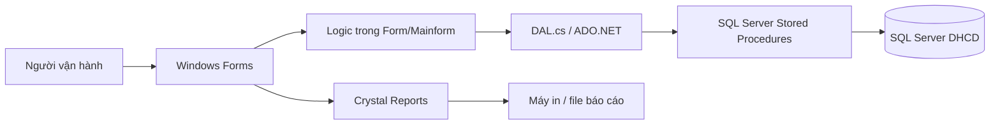
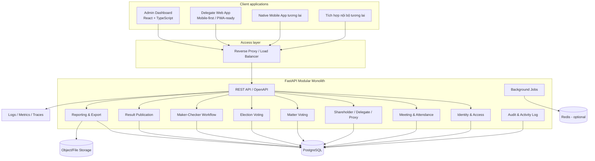
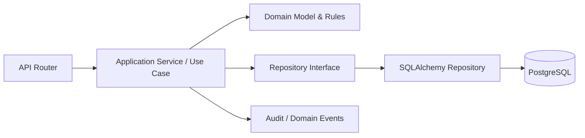
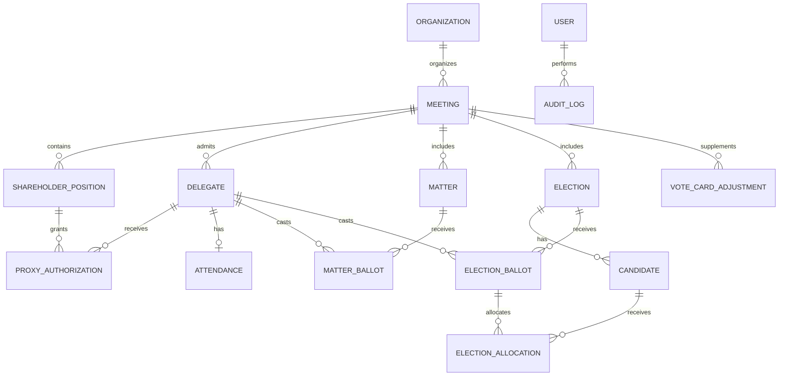
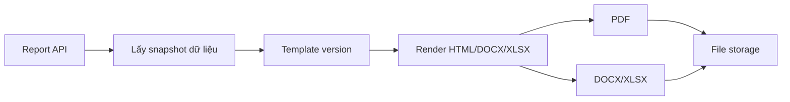
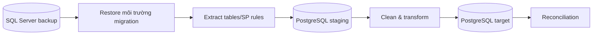

# Kiến trúc mục tiêu hệ thống Đại hội cổ đông APG

**Tên hệ thống:** DHCD-NewAPG  
**Loại tài liệu:** Phân tích hiện trạng và đề xuất kiến trúc chuyển đổi  
**Phiên bản:** 0.3 - Business Decisions Incorporated  
**Ngày lập:** 22/06/2026  
**Trạng thái:** Architecture baseline cho implementation; còn một số chi tiết security/UX cần đặc tả

---

## 1. Mục đích tài liệu

Tài liệu này mô tả kiến trúc mục tiêu để chuyển hệ thống quản lý Đại hội cổ đông hiện tại từ ứng dụng Windows Forms dùng SQL Server và Crystal Reports sang nền tảng API-first:

- Backend: Python, FastAPI.
- Database: PostgreSQL.
- Web frontend: React, TypeScript, gồm Admin Dashboard và Delegate Web App mobile-first.
- UI foundation: shadcn/ui.
- Grid, dashboard và các component dữ liệu phức tạp: có thể dùng Syncfusion React.
- Mobile app trong tương lai có tra cứu, check-in và bỏ phiếu, sử dụng lại cùng API.

Tài liệu này là cơ sở để thống nhất:

1. Phạm vi chuyển đổi.
2. Kiến trúc backend, frontend và dữ liệu.
3. Cách bảo toàn quy tắc nghiệp vụ hiện tại.
4. Chuẩn API dùng chung cho web và mobile.
5. Phương án migration dữ liệu SQL Server sang PostgreSQL.
6. Lộ trình implementation và nghiệm thu.

**Tài liệu chưa bao gồm code implementation.** Các quyết định kiến trúc chính tại mục 23 đã được thống nhất và là baseline để bắt đầu thiết kế vật lý, API contract và implementation.

---

## 2. Nguồn phân tích

Kiến trúc được xây dựng dựa trên:

- `DHCD-NewAPG-Solution-Architecture.md`.
- `HE_THONG_DHCD.md`.
- Source code đang được build từ các file C# trong `FormUI` và `DAL`.
- `DAL/DAL.cs` và danh sách stored procedure được ứng dụng gọi.
- Các form thuộc `FormUI/Meeting`, `FormUI/Vote`, `FormUI/Report`.
- Các mẫu Crystal Reports, DataSet báo cáo và tài liệu báo cáo hiện có.
- File backup cơ sở dữ liệu `Database/dhcd.bak`.
- Database SQL Server local `DHCD` đã restore, được khảo sát read-only.
- `DHCD-Legacy-Database-Discovery.md`.

### 2.1. Trạng thái khảo sát database

Database `DHCD` đã được đọc trực tiếp để xác minh:

- 17 user table, trong đó có bảng diagram và các bảng import/staging.
- 72 stored procedure, bao gồm procedure phục vụ database diagram.
- 8 view nghiệp vụ.
- Primary key và kiểu dữ liệu hiện tại.
- Không có foreign key nghiệp vụ.
- Không có check constraint nghiệp vụ.
- Business rule trọng yếu trong stored procedure.
- Số lượng record hiện có theo bảng.

Data model tại tài liệu này vẫn là **logical target model**, nhưng không còn chỉ dựa trên suy luận từ source code. Nó đã được đối chiếu với schema và logic SQL Server thực tế. Trước migration chính thức vẫn cần chạy data-quality audit, trích xuất mapping cấp cột và đối soát dữ liệu lịch sử.

---

## 3. Tóm tắt hiện trạng

### 3.1. Công nghệ hiện tại

| Thành phần | Hiện trạng |
|---|---|
| Ứng dụng | Windows Forms |
| Runtime | .NET Framework 4.8 |
| Ngôn ngữ | C# là source build chính; repository còn nhiều file VB.NET cũ |
| Database | SQL Server |
| Data access | ADO.NET, gọi stored procedure trực tiếp |
| Business logic | Phân tán giữa form, DAL và stored procedure |
| Reporting | Crystal Reports, một phần kết xuất Excel/DOCX |
| API | Chưa có |
| Authentication/authorization | Chưa thấy lớp xác thực và phân quyền hoàn chỉnh trong code khảo sát |
| Deployment | Desktop application kết nối trực tiếp database |

### 3.2. Kiến trúc hiện tại



### 3.3. Các module nghiệp vụ hiện có

1. Quản lý cuộc họp.
2. Quản lý cổ đông.
3. Quản lý đại biểu tham dự.
4. Quản lý ủy quyền.
5. Quản lý vấn đề biểu quyết.
6. Ghi nhận và tổng hợp phiếu biểu quyết.
7. Quản lý kỳ bầu cử.
8. Quản lý ứng viên.
9. Ghi nhận và tổng hợp phiếu bầu.
10. Quản lý phiếu bầu không hợp lệ.
11. In thẻ, phiếu, biên bản và báo cáo.
12. Kết xuất danh sách ra Excel.

### 3.4. Các quy tắc nghiệp vụ quan trọng đã thấy trong code

- Mỗi cuộc họp là một phạm vi dữ liệu độc lập.
- Cổ đông có số cổ phần và số quyền biểu quyết.
- Một cổ đông có thể ủy quyền toàn bộ hoặc một phần quyền biểu quyết.
- Tổng quyền đã ủy quyền không được vượt quá quyền còn lại của cổ đông.
- Đại biểu có tổng quyền biểu quyết được hình thành từ các record trong `Authorizations`.
- Quyền tham dự trực tiếp hiện cũng được biểu diễn theo mô hình cổ đông “tự ủy quyền” cho đại biểu của chính mình; quyền nhận từ cổ đông khác là tham dự theo ủy quyền.
- Khi tạo đại biểu, hệ thống không cho trùng số định danh trong cùng cuộc họp và cảnh báo nếu cổ đông đã ủy quyền một phần cho người khác.
- Một phiếu biểu quyết của đại biểu cho một vấn đề có một trong các trạng thái:
  - Đồng ý.
  - Không đồng ý.
  - Không có ý kiến.
  - Không hợp lệ.
- Mỗi vấn đề có tỷ lệ thông qua yêu cầu riêng.
- Phiếu bầu cử dùng phương thức phân bổ số phiếu cho các ứng viên.
- Tổng số phiếu phân bổ không được vượt quyền bầu tối đa của đại biểu nhân với số lượng ứng viên được bầu.
- Phiếu bầu cử có thể được đánh dấu không hợp lệ.
- Hệ thống tổng hợp số phiếu hợp lệ, không hợp lệ, quyền biểu quyết và tỷ lệ.
- Có thao tác gán cùng kết quả biểu quyết cho các đại biểu chưa nhập phiếu.
- Có dữ liệu “thẻ biểu quyết” nhập tay để bổ sung cho biên bản/báo cáo.
- Tỷ lệ tham dự được tính từ tổng quyền tham dự chia tổng quyền của cuộc họp.
- Tổng quyền tham dự legacy hiện được lấy từ `SUM(Authorizations.DelegateRight)`.

Các quy tắc trên phải được chuyển vào backend và được bảo vệ bằng transaction/constraint; không để frontend tự quyết định.

---

## 4. Các vấn đề cần xử lý khi chuyển đổi

### 4.1. Logic bị phân tán

Logic hiện nằm ở:

- Event handler của Windows Forms.
- DAL.
- Stored procedure.
- Công thức trong báo cáo.

Nếu chỉ viết API bọc lại từng stored procedure, hệ thống mới sẽ tiếp tục khó bảo trì. Cần gom logic vào application/domain service có test.

Database discovery đã xác nhận các procedure chứa business rule, không chỉ CRUD:

- `Authorizations_Insert/Update`: chống ủy quyền vượt quyền.
- `Delegates_insert`: chống trùng định danh, cảnh báo ủy quyền và cấp mã đại biểu.
- `Mattervotes_Insert`: chống phiếu trùng và kiểm tra matter.
- `Mattervotes_Insert_remain`: nhập hàng loạt cho đại biểu chưa có phiếu.
- `Electionvotes_Insert`: chống nhập hợp lệ/không hợp lệ đồng thời và chống bầu vượt quyền.
- Các procedure/view tổng hợp: tính tham dự, kết quả biểu quyết và bầu cử.

### 4.2. Desktop kết nối trực tiếp database

Mô hình hiện tại:

- Không có biên API.
- Khó phân quyền theo hành động.
- Khó audit thay đổi.
- Khó hỗ trợ mobile.
- Khó kiểm soát đồng thời khi nhiều máy nhập phiếu.

### 4.3. Định danh phụ thuộc mã nghiệp vụ

Nhiều record đang được định danh bằng tổ hợp như:

- `meetingcode + holdercode`.
- `meetingcode + delegatecode`.
- `meetingcode + mattercode`.
- `meetingcode + electioncode + candidatecode`.

Kiến trúc mới nên giữ mã nghiệp vụ để hiển thị/tìm kiếm, nhưng dùng UUID làm khóa kỹ thuật và foreign key.

### 4.4. Kiểu dữ liệu chưa nhất quán

Code hiện tại có trường hợp:

- Số được truyền qua `varchar`.
- Ngày được truyền dưới chuỗi `dd/MM/yyyy`.
- Mã có lúc là chuỗi, có lúc ép sang số.
- Quyền biểu quyết dùng `int`/`decimal` không thống nhất.

PostgreSQL target phải dùng kiểu dữ liệu chặt chẽ.

Các bất nhất đã xác minh trong database:

- `Meetingcode` có độ dài 10, 20 hoặc 50 tùy object.
- `DelegateCode` là `int` trong `Delegates` nhưng là `varchar(10)` trong `MatterVotes`.
- `Holdercode` là `varchar` trong bảng chính nhưng là `bigint` trong `HoldersImport`.
- `IdentityDate` là chuỗi.
- Bảng nguồn cổ đông dùng `float` cho số cổ phần.
- Procedure insert/update cổ đông không thống nhất `bigint` và `int`.

### 4.5. Rủi ro đồng thời

Các thao tác ủy quyền, nhập phiếu và cập nhật phiếu có thể bị hai người thao tác cùng lúc. Backend mới phải:

- Dùng transaction.
- Khóa record phù hợp khi phân bổ quyền.
- Có optimistic concurrency hoặc version column.
- Có unique constraint chống nhập trùng.
- Có idempotency cho các thao tác ghi quan trọng.

Rủi ro đã xác minh:

- Procedure ủy quyền dùng mô hình “đọc tổng rồi ghi” nhưng không khóa record cổ đông rõ ràng.
- `Delegates_insert` cấp mã bằng `MAX(DelegateCode) + 1`.
- Phiếu bầu được ghi từng candidate, có thể để lại trạng thái dở dang nếu một lần ghi thất bại giữa chừng.

### 4.6. Thiếu integrity constraint trong database legacy

Database legacy không có foreign key và check constraint nghiệp vụ. Vì vậy có khả năng tồn tại:

- Record mồ côi giữa vote, delegate, matter, election và candidate.
- Quyền hoặc phiếu âm.
- Phiếu biểu quyết có nhiều boolean cùng bằng `true`.
- Tỷ lệ thông qua hoặc số lượng ứng viên không hợp lệ.

PostgreSQL target phải bổ sung foreign key, unique constraint và check constraint; migration phải kiểm tra và xử lý dữ liệu vi phạm trước khi load.

### 4.7. Reporting phụ thuộc Crystal Reports

Crystal Reports không phù hợp với backend Python/Linux. Cần tái tạo báo cáo bằng template HTML/DOCX/XLSX rồi render PDF ở server.

---

## 5. Nguyên tắc kiến trúc mục tiêu

1. **API-first:** mọi nghiệp vụ được cung cấp qua API, web và mobile là client.
2. **Backend owns business rules:** frontend không trực tiếp tính hoặc quyết định kết quả chính thức.
3. **Modular monolith trước:** chia module rõ ràng trong một service FastAPI để giảm độ phức tạp vận hành.
4. **Database per application:** chỉ backend truy cập PostgreSQL.
5. **Contract-driven:** OpenAPI là hợp đồng giữa backend, web và mobile.
6. **Audit by default:** mọi thay đổi nghiệp vụ quan trọng có dấu vết.
7. **Transaction-safe:** ghi nhận quyền và phiếu phải nguyên tử.
8. **Mobile-ready:** API không phụ thuộc layout web hay session của trình duyệt.
9. **Backward-verifiable:** kết quả mới phải đối soát được với hệ thống cũ.
10. **Security by default:** không lưu credential trong source code; áp dụng least privilege.
11. **Vietnamese-first, locale-safe:** lưu dữ liệu chuẩn Unicode, ngày giờ theo ISO 8601, format tại client.
12. **No premature microservices:** chỉ tách service khi có nhu cầu tải, tổ chức hoặc deployment rõ ràng.
13. **Two experiences, one domain:** Admin Dashboard và Delegate Web App có UX khác nhau nhưng dùng chung API/domain rule.
14. **Publish-controlled realtime:** kết quả chỉ hiển thị realtime cho đại biểu sau khi được admin chốt và công bố.
15. **Maker-checker for corrections:** sửa phiếu là quy trình nội bộ có người tạo yêu cầu và người duyệt độc lập.

---

## 6. Kiến trúc tổng thể đề xuất



### 6.1. Kiểu triển khai ban đầu

Hệ thống được triển khai on-premise. Đề xuất các workload chính:

1. `admin-web`: Admin Dashboard.
2. `delegate-web`: Delegate Web App mobile-first, có thể triển khai PWA.
3. `api`: FastAPI application.
4. `db`: PostgreSQL.
5. `print-agent`: dịch vụ cục bộ cho silent/direct printing và in hàng loạt.

Thành phần tùy chọn khi cần:

- `worker`: xử lý báo cáo nặng, import/export, gửi thông báo.
- `redis`: queue, cache, rate limit hoặc distributed lock.
- object storage: lưu file import, file báo cáo, tài liệu đính kèm.

Admin Web và Delegate Web có thể nằm trong cùng monorepo nhưng là hai application entry point/build artifact độc lập. Điều này giúp:

- Tách route, layout và security boundary.
- Giữ Admin Dashboard tối ưu cho nghiệp vụ vận hành.
- Giữ Delegate Web đơn giản, mobile-first và sẵn sàng chuyển thành mobile app.
- Không đưa component quản trị nặng vào bundle dành cho đại biểu.

---

## 7. Kiến trúc backend FastAPI

### 7.1. Mô hình module

Backend là modular monolith với các lớp:



### 7.2. Trách nhiệm từng lớp

#### API layer

- Parse request.
- Authentication và authorization.
- Validate schema cơ bản bằng Pydantic.
- Gọi use case.
- Chuyển lỗi nghiệp vụ thành HTTP response chuẩn.
- Không viết query và không chứa công thức tính phiếu.

#### Application layer

- Điều phối use case.
- Mở/commit/rollback transaction.
- Kiểm tra quyền thao tác.
- Gọi domain service.
- Ghi audit event.
- Điều phối report job.

#### Domain layer

- Quy tắc phân bổ quyền.
- Quy tắc phiếu biểu quyết.
- Quy tắc phiếu bầu cử.
- Xác định hợp lệ/không hợp lệ.
- Tính kết quả và trạng thái thông qua.
- State transition của cuộc họp.

#### Infrastructure layer

- SQLAlchemy model và repository.
- PostgreSQL transaction.
- Storage.
- Cache/queue.
- PDF, Excel, DOCX renderer.
- Logging và telemetry.

### 7.3. Cấu trúc thư mục backend đề xuất

```text
backend/
├── pyproject.toml
├── alembic.ini
├── app/
│   ├── main.py
│   ├── api/
│   │   ├── dependencies.py
│   │   ├── error_handlers.py
│   │   └── v1/
│   │       ├── router.py
│   │       └── endpoints/
│   ├── core/
│   │   ├── config.py
│   │   ├── database.py
│   │   ├── security.py
│   │   ├── logging.py
│   │   └── permissions.py
│   ├── modules/
│   │   ├── identity/
│   │   ├── meetings/
│   │   ├── shareholders/
│   │   ├── delegates/
│   │   ├── proxies/
│   │   ├── attendance/
│   │   ├── matter_voting/
│   │   ├── elections/
│   │   ├── reports/
│   │   └── audit/
│   ├── shared/
│   │   ├── domain/
│   │   ├── schemas/
│   │   └── infrastructure/
│   └── tests/
│       ├── unit/
│       ├── integration/
│       └── contract/
└── migrations/
```

Mỗi module nên chứa:

```text
module_name/
├── api.py
├── schemas.py
├── models.py
├── repository.py
├── service.py
├── domain.py
└── exceptions.py
```

### 7.4. Technology baseline backend

| Nhóm | Đề xuất |
|---|---|
| Web framework | FastAPI |
| Validation/serialization | Pydantic |
| ORM | SQLAlchemy 2.x |
| PostgreSQL driver | asyncpg |
| Migration | Alembic |
| Server | Uvicorn |
| Test | pytest, pytest-asyncio, HTTPX |
| Lint/format | Ruff |
| Type checking | mypy hoặc pyright |
| Settings | pydantic-settings |
| Authentication | OIDC/OAuth2 hoặc JWT access token |
| Password hashing nếu local account | Argon2id |
| Report | HTML template + headless browser/PDF engine; DOCX/XLSX theo template |

Việc pin version cụ thể được thực hiện khi khởi tạo project, không cố định version trong tài liệu kiến trúc.

---

## 8. Phân rã module nghiệp vụ

### 8.1. Identity & Access

- Local user.
- Hai loại principal: internal staff và delegate.
- Role.
- Permission.
- User-role assignment.
- Liên kết tài khoản delegate với đúng delegate record và meeting scope.
- Refresh token/session.
- Login history.
- Account lock/deactivation.
- Activation/reset credential.
- Thu hồi tất cả session khi có sự cố.

### 8.2. Meeting Management

- Tạo và cập nhật cuộc họp.
- Chọn cuộc họp đang thao tác.
- Trạng thái cuộc họp.
- Thông tin công ty, địa điểm, thời gian, nhiệm kỳ, loại đại hội, mã chứng khoán.
- Cấu hình biểu quyết/bầu cử theo cuộc họp.

### 8.3. Shareholder Registry

- Danh sách cổ đông theo cuộc họp.
- Số đăng ký sở hữu.
- CCCD/HC/GPKD.
- Địa chỉ.
- Số cổ phần.
- Quyền biểu quyết.
- Import hàng loạt.
- Kiểm tra dữ liệu trùng hoặc thiếu.

### 8.4. Delegate & Attendance

- Tạo đại biểu.
- Đại biểu là cổ đông trực tiếp hoặc người được ủy quyền.
- Check-in/check-out.
- Mã đại biểu.
- Tổng quyền tham dự.
- In phiếu xác nhận/thẻ biểu quyết.
- Dashboard tỷ lệ tham dự.
- Đại biểu tự check-in qua Delegate Web hoặc mobile khi đáp ứng điều kiện xác thực.
- Nhân viên vẫn có thể check-in hộ với permission và audit log.

### 8.5. Proxy Authorization

- Cổ đông ủy quyền cho đại biểu.
- Hỗ trợ ủy quyền một phần.
- Theo dõi quyền còn lại.
- Không cho tổng quyền ủy quyền vượt quyền cổ đông.
- Lịch sử điều chỉnh/hủy ủy quyền.

### 8.6. Matter Voting

- Danh sách vấn đề biểu quyết.
- Tỷ lệ thông qua yêu cầu.
- Mở/đóng nhận phiếu.
- Nhập phiếu theo đại biểu.
- Đại biểu tự bỏ phiếu cho chính mình.
- Nhân viên được phép nhập hộ, phải ghi nhận actor và acting-on-behalf-of.
- Nhập hàng loạt cho đại biểu còn lại.
- Phân loại hợp lệ/không hợp lệ.
- Tổng hợp quyền theo lựa chọn.
- Chốt và công bố kết quả.
- Mẫu số ngưỡng thông qua là tổng quyền tham dự.
- Quyền của phiếu được tính theo quyền hiện tại tại thời điểm submit; giá trị đã dùng được lưu snapshot để audit.

### 8.7. Election

- Kỳ bầu cử HĐQT/BKS hoặc loại khác.
- Số lượng thành viên được bầu.
- Danh sách ứng viên.
- Nhập phân bổ phiếu theo đại biểu và ứng viên.
- Đánh dấu phiếu không hợp lệ.
- Kiểm tra tổng số phiếu tối đa.
- Phiếu không phân bổ hết quyền vẫn hợp lệ.
- Phần quyền lẻ hoặc không sử dụng không được tự động phân bổ; phép chia đều dùng round-down.
- Xếp hạng và chốt kết quả.

### 8.8. Reporting

- Phiếu xác nhận tham dự.
- Thẻ biểu quyết.
- Phiếu biểu quyết.
- Phiếu bầu HĐQT/BKS.
- Danh sách cổ đông, đại biểu và ủy quyền.
- Tổng hợp tham dự.
- Kết quả biểu quyết.
- Kết quả bầu cử.
- Biên bản kiểm phiếu.
- Biên bản đại hội.
- Excel export.

### 8.9. Audit

- Ai thực hiện.
- Hành động.
- Thời điểm.
- Đối tượng.
- Giá trị trước/sau.
- Request/correlation ID.
- Lý do điều chỉnh nếu hành động nhạy cảm.

### 8.10. Approval Workflow

- Chỉ nhân viên nội bộ có quyền mới được yêu cầu sửa phiếu.
- Maker tạo yêu cầu sửa, cung cấp lý do và giá trị đề xuất.
- Checker phải là một tài khoản nội bộ khác maker.
- Chỉ sau khi checker duyệt, backend mới áp dụng thay đổi trong transaction.
- Phiếu cũ không bị xóa khỏi lịch sử; lưu revision trước/sau.
- Đại biểu không được tự sửa phiếu qua workflow này.

### 8.11. Result Publication

- Kết quả tính toán nội bộ không tự động hiển thị cho đại biểu.
- Admin/Supervisor chốt và công bố riêng cho từng matter/election.
- Sau publish, Delegate Web và mobile nhận sự kiện realtime và hiển thị kết quả.
- Có thể thu hồi công bố chỉ bằng permission đặc biệt, lý do và audit.
- Payload realtime chỉ chứa dữ liệu đã được phép công khai.

---

## 9. Mô hình dữ liệu logic PostgreSQL

### 9.1. Quy ước chung

- Primary key: UUID.
- Mã nghiệp vụ vẫn được giữ, ví dụ `meeting_code`, `holder_code`, `delegate_code`.
- Thời gian: `timestamptz`, lưu UTC và hiển thị Asia/Bangkok.
- Ngày không có thời gian: `date`.
- Số cổ phần/quyền/phiếu: `bigint` nếu chỉ là số nguyên.
- Tỷ lệ: `numeric(7,4)` hoặc integer basis points tùy quyết định implementation.
- Tiền hoặc số thập phân nghiệp vụ: `numeric`, không dùng float.
- Tất cả table nghiệp vụ có `created_at`, `created_by`, `updated_at`, `updated_by`.
- Record cần đồng thời có `version` cho optimistic locking.
- Hạn chế hard delete; ưu tiên `is_active`, `cancelled_at` hoặc trạng thái nghiệp vụ.
- Mọi quan hệ nghiệp vụ phải có foreign key; không lặp lại mô hình chỉ dựa vào convention như legacy.
- Các giá trị quyền/phiếu phải có check constraint không âm.

### 9.2. Entity chính



### 9.3. Danh sách table mục tiêu

#### `organizations`

- `id`.
- `code`.
- `name`.
- `stock_code`.
- `address`.
- `is_active`.

#### `meetings`

- `id`.
- `organization_id`.
- `meeting_code`.
- `name`.
- `meeting_type`.
- `term`.
- `meeting_at`.
- `venue`.
- `status`.
- `timezone`.
- `total_eligible_shares`.
- `total_eligible_voting_rights`.
- `result_locked_at`.

Unique: `(organization_id, meeting_code)`.

#### `shareholder_positions`

Snapshot cổ đông tại ngày chốt danh sách cho một cuộc họp:

- `id`.
- `meeting_id`.
- `holder_code`.
- `identity_number`.
- `identity_issued_date`.
- `holder_name`.
- `address`.
- `shares`.
- `voting_rights`.
- `source_row`.
- `import_batch_id`.

Unique: `(meeting_id, holder_code)`.

#### `delegates`

- `id`.
- `meeting_id`.
- `delegate_code`.
- `identity_number`.
- `name`.
- `address`.
- `delegate_type`: direct shareholder, proxy, guest.
- `linked_shareholder_position_id` nullable.
- `status`.

Unique: `(meeting_id, delegate_code)`.

Stored procedure `Delegates_insert` hiện không cho trùng số định danh trong cùng cuộc họp. Target đề xuất unique trên `(meeting_id, normalized_identity_number)` sau khi data-quality audit xác nhận dữ liệu lịch sử có thể đáp ứng. API tìm kiếm vẫn phải xử lý kết quả không duy nhất trong giai đoạn migration/compatibility.

#### `proxy_authorizations`

- `id`.
- `meeting_id`.
- `shareholder_position_id`.
- `delegate_id`.
- `authorized_voting_rights`.
- `status`.
- `authorized_at`.
- `cancelled_at`.
- `note`.
- `version`.

Các invariant:

- `authorized_voting_rights > 0`.
- Cổ đông và đại biểu phải cùng cuộc họp.
- Tổng authorization đang hiệu lực của một cổ đông không vượt `voting_rights`.

Để tương thích nghiệp vụ legacy, authorization có thể bao gồm:

- Self-authorization: cổ đông trực tiếp tham dự và phân quyền cho đại biểu của chính mình.
- External proxy: cổ đông phân quyền cho đại biểu khác.

Target vẫn lưu chung một cấu trúc phân bổ quyền, nhưng phân loại rõ `authorization_type` để báo cáo và kiểm toán dễ hơn.

#### `attendances`

- `id`.
- `meeting_id`.
- `delegate_id`.
- `status`.
- `checked_in_at`.
- `checked_out_at`.
- `check_in_method`.
- `effective_voting_rights_snapshot`.

Snapshot quyền tại check-in giúp báo cáo lịch sử ổn định, nhưng tổng quyền chính thức vẫn phải được xác định theo quy tắc được thống nhất.

#### `matters`

- `id`.
- `meeting_id`.
- `matter_code`.
- `name`.
- `description`.
- `display_order`.
- `approval_threshold`.
- `status`: draft, open, closed, published.
- `opened_at`.
- `closed_at`.

Unique: `(meeting_id, matter_code)`.

#### `matter_ballots`

- `id`.
- `meeting_id`.
- `matter_id`.
- `delegate_id`.
- `choice`: agree, disagree, abstain, invalid.
- `voting_rights_snapshot`.
- `source`: manual, batch, import, mobile.
- `submitted_at`.
- `version`.

Unique: `(matter_id, delegate_id)`.

Không lưu đồng thời bốn cột boolean `agree/disagree/noidea/illegal`; dùng một enum để loại bỏ trạng thái mâu thuẫn.

#### `elections`

- `id`.
- `meeting_id`.
- `election_code`.
- `name`.
- `description`.
- `seats`.
- `status`.
- `opened_at`.
- `closed_at`.

Unique: `(meeting_id, election_code)`.

#### `candidates`

- `id`.
- `election_id`.
- `candidate_code`.
- `name`.
- `address`.
- `display_order`.
- `status`.

Unique: `(election_id, candidate_code)`.

#### `election_ballots`

- `id`.
- `meeting_id`.
- `election_id`.
- `delegate_id`.
- `status`: valid, invalid.
- `invalid_reason`.
- `base_voting_rights_snapshot`.
- `max_allocatable_votes_snapshot`.
- `submitted_at`.
- `version`.

Unique: `(election_id, delegate_id)`.

#### `election_allocations`

- `id`.
- `election_ballot_id`.
- `candidate_id`.
- `votes`.

Unique: `(election_ballot_id, candidate_id)`.

Invariant: tổng `votes` của ballot không vượt `max_allocatable_votes_snapshot`.

#### `vote_card_adjustments`

Thay cho nghiệp vụ `VoteCards_Upsert` hiện tại:

- `id`.
- `meeting_id`.
- `matter_id`.
- `description`.
- `agree_voting_rights`.
- `disagree_voting_rights`.
- `abstain_voting_rights`.
- `reason`.

Đơn vị đã chốt là quyền biểu quyết, không phải số lượng thẻ.

#### `report_templates` và `generated_reports`

- Quản lý version template.
- Lưu loại báo cáo, checksum, người tạo, thời điểm tạo.
- Lưu file URL/path, mime type và trạng thái job.

#### `audit_logs`

- Append-only.
- Không cho user nghiệp vụ sửa/xóa.
- Có thể partition theo tháng khi dữ liệu lớn.

#### `user_accounts`

- `id`.
- `username`.
- `password_hash`.
- `principal_type`: internal hoặc delegate.
- `status`.
- `failed_login_count`.
- `locked_until`.
- `last_login_at`.

Không lưu mật khẩu thuần. Credential của đại biểu cần quy trình kích hoạt/reset an toàn.

#### `delegate_account_links`

- `user_account_id`.
- `delegate_id`.
- `meeting_id`.
- `status`.

Mọi API self-service lấy delegate identity từ access token/server-side link, không nhận `delegateId` tùy ý từ client để quyết định chủ thể.

#### `ballot_change_requests`

- `id`.
- `ballot_type`.
- `ballot_id`.
- `requested_by`.
- `reason`.
- `before_payload`.
- `proposed_payload`.
- `status`: pending, approved, rejected, applied.
- `reviewed_by`.
- `reviewed_at`.
- `review_note`.

Constraint nghiệp vụ: `requested_by != reviewed_by`.

#### `result_publications`

- `id`.
- `meeting_id`.
- `subject_type`: matter hoặc election.
- `subject_id`.
- `result_version`.
- `published_by`.
- `published_at`.
- `revoked_by`.
- `revoked_at`.
- `status`.

Delegate Web/mobile chỉ đọc result version đang được publish.

---

## 10. Trạng thái và khóa sổ nghiệp vụ

### 10.1. Trạng thái cuộc họp

```text
DRAFT -> PREPARING -> OPEN -> CLOSED -> FINALIZED -> ARCHIVED
```

- `DRAFT`: cấu hình ban đầu.
- `PREPARING`: nhập cổ đông, đại biểu, nội dung.
- `OPEN`: đang diễn ra, cho check-in và nhập phiếu.
- `CLOSED`: ngừng nhận thao tác mới, cho phép đối soát.
- `FINALIZED`: kết quả đã chốt; chỉnh sửa phải qua quy trình đặc biệt.
- `ARCHIVED`: chỉ đọc.

### 10.2. Khóa sổ

Sau `FINALIZED`:

- Không được sửa cổ đông, quyền, ủy quyền, phiếu.
- Báo cáo chính thức gắn với version dữ liệu đã chốt.
- Nếu mở khóa phải có quyền đặc biệt, lý do và audit log.

### 10.3. Trạng thái kết quả

Mỗi matter/election có luồng:

```text
OPEN -> CLOSED -> CALCULATED -> FINALIZED -> PUBLISHED
```

- `FINALIZED` là chốt nội bộ.
- `PUBLISHED` mới cho phép đại biểu xem kết quả.
- Realtime event chỉ phát sau transition sang `PUBLISHED`.
- Sửa phiếu sau khi đóng/chốt phải qua maker-checker và tạo result version mới trước khi công bố lại.

---

## 11. Thiết kế API

### 11.1. Chuẩn chung

- Base path: `/api/v1`.
- JSON dùng `camelCase` ở API; Python model có thể dùng `snake_case`.
- Thời gian dùng ISO 8601 kèm timezone.
- ID kỹ thuật dùng UUID.
- Mã nghiệp vụ là field riêng, không dùng làm URL identity chính.
- OpenAPI do FastAPI sinh là nguồn hợp đồng chính.
- Sinh TypeScript client từ OpenAPI để giảm sai khác contract.
- Mobile dùng cùng endpoint; không tạo “web API” và “mobile API” chứa logic riêng.
- Endpoint dành cho đại biểu dùng prefix `/api/v1/me` hoặc xác định subject từ token, tránh horizontal privilege escalation.

### 11.2. Response thành công

Resource đơn:

```json
{
  "data": {
    "id": "uuid",
    "meetingCode": "AGM-2026",
    "name": "Đại hội đồng cổ đông thường niên 2026"
  },
  "meta": {
    "requestId": "uuid"
  }
}
```

Danh sách:

```json
{
  "data": [],
  "pagination": {
    "page": 1,
    "pageSize": 50,
    "totalItems": 0,
    "totalPages": 0
  },
  "meta": {
    "requestId": "uuid"
  }
}
```

### 11.3. Error format

Áp dụng một format thống nhất, gần với Problem Details:

```json
{
  "type": "https://api.example.vn/problems/proxy-rights-exceeded",
  "title": "Số quyền ủy quyền vượt quá số quyền còn lại",
  "status": 409,
  "code": "PROXY_RIGHTS_EXCEEDED",
  "detail": "Cổ đông chỉ còn 1200 quyền biểu quyết.",
  "fieldErrors": {
    "authorizedVotingRights": ["Giá trị tối đa là 1200."]
  },
  "requestId": "uuid"
}
```

### 11.4. Filtering, sorting và paging

Ví dụ:

```text
GET /api/v1/meetings/{meetingId}/shareholders
    ?page=1
    &pageSize=50
    &search=nguyen
    &sort=holderCode
    &order=asc
```

Grid có thể yêu cầu filter phức tạp. Không expose SQL-like expression trực tiếp. Backend định nghĩa whitelist field và operator.

### 11.5. Idempotency

Các endpoint nhập phiếu/import có thể nhận header:

```text
Idempotency-Key: <client-generated-uuid>
```

Nếu client retry do mất mạng, backend không tạo phiếu trùng.

### 11.6. Concurrency

Response của resource nhạy cảm có `version`. Update gửi lại version:

```json
{
  "choice": "agree",
  "version": 3
}
```

Nếu record đã thay đổi, trả `409 CONCURRENT_UPDATE`.

---

## 12. Danh mục endpoint cấp cao

Danh sách dưới đây là catalog ban đầu, chưa phải OpenAPI chi tiết.

### 12.1. Authentication

```text
POST   /api/v1/auth/login
POST   /api/v1/auth/refresh
POST   /api/v1/auth/logout
GET    /api/v1/auth/me
```

Nếu tích hợp OIDC/SSO, login flow sẽ thay đổi nhưng permission model giữ nguyên.

### 12.2. Meetings

```text
GET    /api/v1/meetings
POST   /api/v1/meetings
GET    /api/v1/meetings/{meetingId}
PATCH  /api/v1/meetings/{meetingId}
POST   /api/v1/meetings/{meetingId}/open
POST   /api/v1/meetings/{meetingId}/close
POST   /api/v1/meetings/{meetingId}/finalize
GET    /api/v1/meetings/{meetingId}/dashboard
```

### 12.3. Shareholders

```text
GET    /api/v1/meetings/{meetingId}/shareholders
POST   /api/v1/meetings/{meetingId}/shareholders
GET    /api/v1/meetings/{meetingId}/shareholders/{shareholderId}
PATCH  /api/v1/meetings/{meetingId}/shareholders/{shareholderId}
POST   /api/v1/meetings/{meetingId}/shareholders/import
GET    /api/v1/meetings/{meetingId}/shareholders/imports/{jobId}
```

### 12.4. Delegates and attendance

```text
GET    /api/v1/meetings/{meetingId}/delegates
POST   /api/v1/meetings/{meetingId}/delegates
GET    /api/v1/meetings/{meetingId}/delegates/{delegateId}
PATCH  /api/v1/meetings/{meetingId}/delegates/{delegateId}
POST   /api/v1/meetings/{meetingId}/delegates/{delegateId}/check-in
POST   /api/v1/meetings/{meetingId}/delegates/{delegateId}/check-out
GET    /api/v1/meetings/{meetingId}/attendance/summary
```

### 12.5. Proxy authorizations

```text
GET    /api/v1/meetings/{meetingId}/proxy-authorizations
POST   /api/v1/meetings/{meetingId}/proxy-authorizations
PATCH  /api/v1/meetings/{meetingId}/proxy-authorizations/{authorizationId}
POST   /api/v1/meetings/{meetingId}/proxy-authorizations/{authorizationId}/cancel
GET    /api/v1/meetings/{meetingId}/shareholders/{shareholderId}/remaining-rights
```

### 12.6. Matter voting

```text
GET    /api/v1/meetings/{meetingId}/matters
POST   /api/v1/meetings/{meetingId}/matters
PATCH  /api/v1/meetings/{meetingId}/matters/{matterId}
POST   /api/v1/meetings/{meetingId}/matters/{matterId}/open
POST   /api/v1/meetings/{meetingId}/matters/{matterId}/close
PUT    /api/v1/meetings/{meetingId}/matters/{matterId}/ballots/{delegateId}
POST   /api/v1/meetings/{meetingId}/matters/{matterId}/ballots/batch
GET    /api/v1/meetings/{meetingId}/matters/{matterId}/ballots
GET    /api/v1/meetings/{meetingId}/matters/{matterId}/result
POST   /api/v1/meetings/{meetingId}/matters/{matterId}/publish
```

`PUT` phù hợp cho ballot vì mỗi cặp matter/delegate chỉ có một ballot.

### 12.7. Elections

```text
GET    /api/v1/meetings/{meetingId}/elections
POST   /api/v1/meetings/{meetingId}/elections
PATCH  /api/v1/meetings/{meetingId}/elections/{electionId}
GET    /api/v1/meetings/{meetingId}/elections/{electionId}/candidates
POST   /api/v1/meetings/{meetingId}/elections/{electionId}/candidates
PATCH  /api/v1/meetings/{meetingId}/elections/{electionId}/candidates/{candidateId}
PUT    /api/v1/meetings/{meetingId}/elections/{electionId}/ballots/{delegateId}
GET    /api/v1/meetings/{meetingId}/elections/{electionId}/ballots
GET    /api/v1/meetings/{meetingId}/elections/{electionId}/result
POST   /api/v1/meetings/{meetingId}/elections/{electionId}/publish
```

Payload ballot chứa toàn bộ allocation để backend validate và ghi trong một transaction:

```json
{
  "status": "valid",
  "allocations": [
    {
      "candidateId": "uuid",
      "votes": 1000
    }
  ],
  "version": 1
}
```

### 12.8. Reports

```text
POST   /api/v1/meetings/{meetingId}/reports
GET    /api/v1/meetings/{meetingId}/reports
GET    /api/v1/meetings/{meetingId}/reports/{reportId}
GET    /api/v1/meetings/{meetingId}/reports/{reportId}/download
```

Tạo report nặng trả `202 Accepted` và `jobId`; report nhỏ có thể trả file đồng bộ.

### 12.9. Delegate self-service

```text
GET    /api/v1/me/profile
GET    /api/v1/me/meetings
GET    /api/v1/me/meetings/{meetingId}
POST   /api/v1/me/meetings/{meetingId}/check-in
GET    /api/v1/me/meetings/{meetingId}/matters
PUT    /api/v1/me/meetings/{meetingId}/matters/{matterId}/ballot
GET    /api/v1/me/meetings/{meetingId}/elections
PUT    /api/v1/me/meetings/{meetingId}/elections/{electionId}/ballot
GET    /api/v1/me/meetings/{meetingId}/published-results
GET    /api/v1/me/meetings/{meetingId}/documents
```

Đại biểu chỉ thao tác trên delegate record đã liên kết với tài khoản. Backend không tin `delegateId` gửi từ trình duyệt.

### 12.10. Maker-checker và công bố

```text
POST   /api/v1/ballot-change-requests
GET    /api/v1/ballot-change-requests
POST   /api/v1/ballot-change-requests/{requestId}/approve
POST   /api/v1/ballot-change-requests/{requestId}/reject
POST   /api/v1/meetings/{meetingId}/matters/{matterId}/publish
POST   /api/v1/meetings/{meetingId}/elections/{electionId}/publish
POST   /api/v1/result-publications/{publicationId}/revoke
```

Approve bị từ chối nếu checker là maker.

---

## 13. Authentication và phân quyền

### 13.1. Phương án đã chọn

Hệ thống dùng tài khoản local cho cả nhân viên nội bộ và đại biểu:

- Access token ngắn hạn.
- Refresh token rotation.
- Hash password bằng Argon2id.
- Khóa tài khoản sau nhiều lần đăng nhập sai.
- Session/device management.
- Audit đăng nhập, đổi và reset mật khẩu.
- Có thể bổ sung OIDC cho nhân viên nội bộ trong tương lai mà không thay đổi domain.

Tài khoản đại biểu phải liên kết server-side với đúng `delegate_id` và `meeting_id`. Các chi tiết cần đặc tả ở security design:

- Cách phát hành/kích hoạt tài khoản lần đầu.
- Chính sách username/mật khẩu hoặc OTP bổ sung.
- Quy trình quên mật khẩu và xác minh danh tính.
- Có cho đăng nhập đồng thời nhiều thiết bị hay không.
- Thời hạn tài khoản sau khi cuộc họp kết thúc.

### 13.2. Role đề xuất

| Role | Quyền chính |
|---|---|
| System Admin | Cấu hình hệ thống, user, role |
| Meeting Admin | Tạo cuộc họp, cấu hình và khóa sổ |
| Registration Operator | Cổ đông, đại biểu, check-in, ủy quyền |
| Voting Operator | Nhập phiếu biểu quyết |
| Election Operator | Nhập phiếu bầu cử |
| Supervisor | Xem, đối soát, duyệt/chốt kết quả |
| Reporter | Tạo và tải báo cáo |
| Auditor | Chỉ đọc dữ liệu và audit log |
| Delegate | Xem dữ liệu của mình, check-in, biểu quyết, bầu cử, tra cứu và xem kết quả đã công bố |

### 13.3. Permission thay vì chỉ kiểm tra role

Ví dụ permission:

- `meeting.read`.
- `meeting.manage`.
- `shareholder.import`.
- `delegate.check_in`.
- `proxy.manage`.
- `matter_vote.submit`.
- `matter_vote.finalize`.
- `election_vote.submit`.
- `election.finalize`.
- `report.generate`.
- `audit.read`.
- `ballot_change.request`.
- `ballot_change.approve`.
- `result.publish`.
- `self.check_in`.
- `self.vote`.
- `self.read`.

API kiểm tra permission và phạm vi meeting.

---

## 14. Kiến trúc frontend React TypeScript

### 14.1. Technology baseline

| Nhóm | Đề xuất |
|---|---|
| Build tool | Vite |
| Framework | React + TypeScript |
| Routing | React Router |
| Server state | TanStack Query |
| Form | React Hook Form |
| Validation | Zod |
| UI primitives | shadcn/ui |
| Styling | Tailwind CSS |
| Data grid/dashboard | Syncfusion React khi phù hợp |
| API client | Sinh từ OpenAPI |
| Test | Vitest, React Testing Library, Playwright |

### 14.2. Ranh giới shadcn/ui và Syncfusion

#### shadcn/ui dùng cho

- Layout.
- Button.
- Dialog, sheet.
- Form control.
- Navigation.
- Tabs.
- Alert.
- Card.
- Command/search.
- Toast.
- Design tokens và theme.

#### Syncfusion cân nhắc dùng cho

- Grid dữ liệu lớn.
- Server-side paging/filter/sort.
- Grouping.
- Export grid.
- Dashboard chart phức tạp.
- Pivot/grid nâng cao nếu có nhu cầu thực tế.

Không dùng hai thư viện để xây hai hệ thống design song song. Syncfusion component phải được bọc trong adapter/component nội bộ để đồng bộ màu sắc, spacing và permission.

### 14.3. Hai web application

#### Admin Dashboard

- Desktop/tablet-first.
- Quản lý meeting, cổ đông, đại biểu, ủy quyền.
- Nhập phiếu hộ.
- Grid dữ liệu lớn.
- Maker-checker.
- Chốt/công bố kết quả.
- Báo cáo và in hàng loạt.

#### Delegate Web App

- Mobile-first.
- Giao diện ít thao tác, chữ và vùng bấm rõ.
- Chỉ hiển thị dữ liệu thuộc tài khoản đang đăng nhập.
- Check-in.
- Tra cứu quyền và nội dung đại hội.
- Biểu quyết và bầu cử.
- Xem trạng thái phiếu đã gửi.
- Nhận kết quả realtime sau khi admin công bố.
- PWA-ready để tận dụng camera/QR và chuẩn bị cho native mobile.

### 14.4. Cấu trúc frontend đề xuất

```text
apps/
├── admin-web/
├── delegate-web/
└── mobile/                 # giai đoạn sau
packages/
├── api-client/             # sinh từ OpenAPI
├── ui/                     # component dùng chung có chọn lọc
├── auth/
├── domain-types/
└── config/
```

Không chia sẻ toàn bộ screen/component giữa admin và delegate; chỉ chia sẻ design token, API client, primitive và type thực sự chung.

### 14.5. Nguyên tắc frontend

- Không gọi database.
- Không lặp lại công thức nghiệp vụ chính thức.
- Hiển thị preview/cảnh báo phía client để UX nhanh, nhưng backend luôn validate lại.
- Không lưu access token dài hạn trong `localStorage` nếu có thể tránh.
- Route và button đều kiểm tra permission, nhưng backend vẫn là lớp bảo vệ thật.
- Grid dùng server-side paging từ đầu để không phụ thuộc kích thước dữ liệu.
- URL chứa meeting context để có thể bookmark và mở nhiều tab.
- Delegate Web không cho chọn/đổi `delegateId` bằng query parameter.
- Sau submit phiếu phải hiển thị receipt/reference và trạng thái server đã ghi nhận.
- Mất kết nối/retry phải dùng idempotency key.

---

## 15. Hỗ trợ mobile trong tương lai

Mobile phase đã xác định gồm tra cứu, check-in và bỏ phiếu. Kiến trúc hiện tại ưu tiên hoàn thiện Delegate Web mobile-first trước, sau đó native mobile sử dụng cùng API:

- JSON contract không phụ thuộc component web.
- Local authentication flow tương thích native app và secure token storage.
- Access token ngắn hạn.
- Pagination ổn định.
- Upload/download chuẩn HTTP.
- API versioning.
- Idempotency cho submit phiếu.
- Payload nhỏ và có endpoint summary.
- Deep link dùng UUID hoặc public identifier.
- Có thể thêm push notification mà không thay đổi domain.

### 15.1. Phạm vi mobile đã xác định

- Check-in bằng QR.
- Tra cứu thông tin đại biểu.
- Nhận tài liệu đại hội.
- Biểu quyết điện tử.
- Bầu cử điện tử.
- Xem kết quả được công bố.

Trước khi bật bỏ phiếu native mobile cần hoàn tất threat model, secure storage, device/session policy và kiểm thử chống gửi trùng/replay.

---

## 16. Realtime và dashboard

### 16.1. Nhu cầu

- Tỷ lệ tham dự thay đổi khi check-in.
- Kết quả tạm thời thay đổi khi nhập phiếu.
- Trạng thái mở/đóng vấn đề cần cập nhật nhanh.
- Kết quả chính thức phải xuất hiện realtime trên Delegate Web/mobile ngay sau khi admin công bố.

### 16.2. Đề xuất

Đề xuất:

- Server-Sent Events (SSE) cho sự kiện một chiều: meeting state, check-in summary và result publication.
- TanStack Query invalidate/refetch khi nhận event.
- Polling là fallback khi SSE bị ngắt.
- WebSocket chỉ dùng nếu sau này có tương tác hai chiều thực sự.
- Event công bố kết quả có `subjectId`, `resultVersion`, `publishedAt`; client refetch endpoint kết quả thay vì tin toàn bộ payload event.
- Đại biểu không nhận kết quả draft/calculated/finalized chưa publish.
- Không để kết nối realtime thay thế transaction ghi dữ liệu.

---

## 17. Reporting và in ấn

### 17.1. Phương án thay Crystal Reports



### 17.2. Quy tắc

- Report service chỉ đọc từ application query/service, không query tùy ý từ template.
- Mỗi báo cáo chính thức lưu:
  - Loại báo cáo.
  - Meeting.
  - Version template.
  - Người tạo.
  - Thời điểm.
  - Checksum file.
- Báo cáo sau khóa sổ phải tái tạo đúng cùng dữ liệu.
- Mẫu báo cáo được phép thiết kế lại, nhưng số liệu và nội dung pháp lý phải đối soát với báo cáo legacy.

### 17.3. Danh sách cần chuyển đổi

Tối thiểu:

- Thông tin cuộc họp.
- Phiếu xác nhận tham dự.
- Thẻ biểu quyết.
- Phiếu biểu quyết.
- Phiếu bầu HĐQT.
- Phiếu bầu BKS.
- Danh sách ủy quyền.
- Báo cáo tỷ lệ tham dự.
- Kết quả biểu quyết.
- Kết quả bầu cử.
- Biên bản xác nhận đại biểu.
- Biên bản kiểm phiếu.
- Biên bản cuộc họp.

### 17.4. In trực tiếp

Silent/direct printing và in hàng loạt là yêu cầu bắt buộc:

- Backend tạo PDF chuẩn in.
- Người dùng preview và in từ trình duyệt.
- Local print agent chạy trên máy/trạm in, nhận print job đã xác thực từ backend.
- Agent quản lý whitelist máy in, số bản, khổ giấy và trạng thái job.
- Admin Dashboard gửi yêu cầu in qua API; trình duyệt không trực tiếp điều khiển máy in.
- Agent phải có pairing/credential riêng, audit và cơ chế retry; không mở cổng in tùy ý trong LAN.

---

## 18. Import và migration dữ liệu

### 18.1. Chiến lược migration



### 18.2. Các bước bắt buộc

1. Restore `dhcd.bak` trên SQL Server cô lập.
2. Inventory table, view, stored procedure, function và constraint.
3. Map từng field sang target model.
4. Phân loại:
   - Dữ liệu master.
   - Dữ liệu snapshot theo meeting.
   - Dữ liệu giao dịch.
   - Dữ liệu báo cáo có thể tái tính.
5. Import vào staging schema.
6. Chuẩn hóa:
   - Unicode.
   - Ngày tháng.
   - Mã có leading zero.
   - Record trùng identity.
   - Null/empty string.
   - Số quyền âm hoặc vượt quyền.
7. Load target tables.
8. Đối soát số lượng record.
9. Đối soát tổng cổ phần/quyền.
10. Đối soát kết quả từng vấn đề và kỳ bầu cử.
11. Lập biên bản sai lệch và quyết định xử lý.

Hai bước đầu đã hoàn thành trên database local `DHCD`. Kết quả sơ bộ được ghi tại `DHCD-Legacy-Database-Discovery.md`. Công việc còn lại bắt đầu từ mapping cấp cột và data-quality audit.

Phạm vi dữ liệu được migrate sang hệ thống mới là meeting `APG2026`. Các bảng nguồn/import chỉ lấy record liên quan hoặc cần thiết để tái lập đầy đủ dữ liệu APG2026. Dữ liệu ngoài phạm vi giữ ở hệ thống legacy/read-only, trừ khi có quyết định mở rộng sau này.

### 18.3. Không dịch stored procedure một-một

Stored procedure được phân loại:

- CRUD đơn giản: chuyển sang repository/service.
- Query báo cáo: chuyển sang query service hoặc view/materialized view khi cần.
- Business rule: chuyển sang domain/application service và test.
- Batch operation: dùng transaction/bulk operation.

### 18.4. Cutover

Đề xuất:

1. Chạy thử nhiều vòng migration.
2. Chọn một cuộc họp lịch sử làm golden dataset.
3. Chạy song song read-only để đối soát.
4. Chốt thời gian ngừng ghi hệ thống cũ.
5. Migration delta/final.
6. Smoke test.
7. Mở hệ thống mới.
8. Giữ hệ thống cũ ở chế độ read-only trong thời hạn thống nhất.

---

## 19. Transaction và integrity

### 19.1. Tạo ủy quyền

Trong một transaction:

1. Lock shareholder position.
2. Tính tổng quyền đã ủy quyền hiệu lực.
3. Kiểm tra quyền còn lại.
4. Tạo/cập nhật authorization.
5. Cập nhật snapshot/tổng hợp nếu có.
6. Ghi audit.
7. Commit.

### 19.2. Ghi phiếu biểu quyết

Trong một transaction:

1. Kiểm tra meeting và matter đang cho phép ghi.
2. Kiểm tra delegate hợp lệ.
3. Tính quyền biểu quyết chính thức.
4. Upsert ballot duy nhất.
5. Quyền được lấy theo trạng thái hiện tại tại thời điểm submit và ghi vào `voting_rights_snapshot`.
6. Ghi audit.

Nếu quyền thay đổi sau khi đã bỏ phiếu, phiếu cũ không tự động đổi theo. Mọi yêu cầu “xử lý lại” phải là use case có chủ đích, tạo revision/audit và tuân theo trạng thái meeting.

### 19.3. Ghi phiếu bầu cử

Trong một transaction:

1. Kiểm tra election đang mở.
2. Lock ballot theo election/delegate.
3. Tính quyền tối đa.
4. Validate candidate thuộc election.
5. Validate vote không âm.
6. Validate tổng allocation.
7. Replace/upsert toàn bộ allocation.
8. Ghi audit.

Tổng allocation có thể nhỏ hơn số quyền tối đa và vẫn hợp lệ. Khi chia đều, hệ thống round-down và không tự phân bổ phần dư.

### 19.4. Batch phiếu còn lại

Trong một transaction hoặc batch có kiểm soát:

1. Chụp danh sách đại biểu chưa có phiếu tại thời điểm thực thi.
2. Tính lại quyền hiện tại của từng đại biểu.
3. Tạo ballot với lựa chọn batch và rights snapshot tại thời điểm đó.
4. Không ghi đè ballot đã tồn tại.
5. Lưu batch ID, actor, tiêu chí, tổng số thành công/thất bại.
6. Cho phép retry idempotent.

### 19.5. Sửa phiếu theo maker-checker

1. Internal maker tạo change request và lý do.
2. Backend lưu before/proposed payload, chưa sửa ballot.
3. Internal checker khác maker duyệt hoặc từ chối.
4. Khi duyệt, backend lock ballot, kiểm tra version và áp dụng revision trong transaction.
5. Nếu kết quả đã publish, tạo result version mới; không âm thầm thay kết quả đại biểu đang xem.

### 19.6. Chốt và công bố kết quả

- Dùng database transaction.
- Không chốt nếu còn job/import chưa hoàn tất.
- Tạo result snapshot.
- Tạo checksum hoặc version.
- Chuyển trạng thái `FINALIZED`.
- Admin thực hiện hành động publish riêng để chuyển sang `PUBLISHED`.
- Sau commit publish mới phát realtime event.
- Từ chối mutation thông thường sau khi chốt.

---

## 20. Security

### 20.1. Yêu cầu tối thiểu

- HTTPS ở mọi môi trường ngoài local.
- Secret qua environment/secret manager.
- Database user riêng, không dùng superuser.
- CORS whitelist.
- Rate limit login và endpoint nhạy cảm.
- Validate upload type/size.
- Antivirus scan nếu nhận tài liệu từ bên ngoài.
- Security header.
- Structured audit log.
- Backup mã hóa.
- Mask dữ liệu định danh trên log.
- Không trả stack trace cho client.

### 20.2. Dữ liệu nhạy cảm

CCCD/HC/GPKD, địa chỉ và thông tin sở hữu là dữ liệu nhạy cảm:

- Chỉ role phù hợp mới xem đầy đủ.
- Có thể mask ở list view.
- Export phải được audit.
- Log không ghi request body chứa toàn bộ thông tin cá nhân.
- Cần thống nhất retention và quyền xóa/lưu trữ theo chính sách APG.
- Endpoint đại biểu bắt buộc scope theo account-to-delegate link ở server.
- Nhân viên nhập hộ phải lưu cả `performed_by` và `on_behalf_of_delegate_id`.

### 20.3. Threats đáng chú ý

- Sửa phiếu sau khi chốt.
- Nhập trùng phiếu do retry.
- Vượt quyền ủy quyền do race condition.
- Export dữ liệu cổ đông trái phép.
- Đoán mã đại biểu.
- Lạm dụng API report gây quá tải.
- Injection qua filter/sort hoặc template.
- Token bị đánh cắp trên máy vận hành.

---

## 21. Logging, monitoring và vận hành

### 21.1. Log

JSON structured log gồm:

- Timestamp.
- Level.
- Service/version.
- Request ID.
- User ID.
- Meeting ID.
- Route.
- Duration.
- Result/error code.

Không log token, password, full identity number hoặc file bí mật.

### 21.2. Metrics

- Request count/latency/error rate.
- Active database connections.
- Slow queries.
- Report job duration/failure.
- Import success/failure.
- Số ballot submit.
- Conflict/idempotent retry count.

### 21.3. Health checks

```text
GET /health/live
GET /health/ready
```

`ready` kiểm tra khả năng kết nối dependency thiết yếu.

### 21.4. Backup

- PostgreSQL automated backup.
- Point-in-time recovery nếu hạ tầng cho phép.
- Kiểm thử restore định kỳ.
- File report/object storage có version/backup.
- Có runbook khôi phục trước ngày đại hội.

---

## 22. Testing và tiêu chí chất lượng

### 22.1. Backend

- Unit test cho mọi công thức quyền và phiếu.
- Integration test với PostgreSQL thật.
- API contract test.
- Permission test.
- Concurrency test.
- Migration/reconciliation test.

### 22.2. Frontend

- Component test cho form và permission.
- Integration test cho API state.
- E2E cho luồng nghiệp vụ chính.
- Visual test cho mẫu in quan trọng.

### 22.3. Golden dataset

Chọn ít nhất một cuộc họp lịch sử có đủ:

- Cổ đông.
- Đại biểu.
- Nhiều ủy quyền.
- Phiếu biểu quyết hợp lệ/không hợp lệ.
- Bầu cử.
- Báo cáo.

Chạy cùng dữ liệu trên hệ thống cũ và mới, so sánh:

- Tổng quyền.
- Tỷ lệ tham dự.
- Kết quả từng matter.
- Kết quả từng candidate.
- Số phiếu hợp lệ/không hợp lệ.
- Nội dung báo cáo.

### 22.4. Definition of Done cấp module

- API có OpenAPI.
- Permission đầy đủ.
- Unit/integration test đạt.
- Audit log đúng.
- UI hoàn tất.
- Import/export nếu thuộc phạm vi.
- Kết quả đối soát với legacy.
- Không còn lỗi mức critical/high.
- Có tài liệu vận hành.

---

## 23. Các quyết định nghiệp vụ và kiến trúc đã chốt

### 23.1. Decision record

| Chủ đề | Quyết định |
|---|---|
| Authentication | Tài khoản local |
| Nhân viên nội bộ | Đăng nhập Admin Dashboard để vận hành |
| Đại biểu | Đăng nhập Delegate Web, chỉ thấy dữ liệu của mình |
| Delegate Web | React mobile-first, tách trải nghiệm khỏi Admin Dashboard |
| Chức năng đại biểu | Tra cứu, check-in, biểu quyết, bầu cử, xem kết quả đã công bố |
| Nhập phiếu | Cả nhân viên nhập hộ và đại biểu tự nhập |
| Mobile | Có tra cứu, check-in và bỏ phiếu |
| Quyền khi bỏ phiếu | Lấy quyền hiện tại tại thời điểm submit và lưu snapshot audit |
| Sửa phiếu | Chỉ nội bộ, bắt buộc maker-checker |
| Batch phiếu còn lại | Tiếp tục hỗ trợ; lấy lại danh sách và quyền tại thời điểm chạy batch |
| VoteCards nhập tay | Đơn vị là quyền biểu quyết |
| Mẫu số thông qua | Tổng quyền tham dự |
| Phiếu bầu không dùng hết quyền | Vẫn hợp lệ; chia đều round-down |
| Báo cáo | Được thiết kế lại |
| In hàng loạt | Bắt buộc silent/direct printing qua local print agent |
| Migration | Chỉ migrate meeting `APG2026` |
| Hạ tầng | On-premise |
| High availability | Không có SLA downtime cứng; tối ưu để downtime thấp nhất có thể |
| Công bố kết quả | Chỉ hiển thị realtime cho đại biểu sau khi admin chốt và publish |

### 23.2. Chi tiết còn cần đặc tả, không chặn architecture baseline

- Cách phát hành/kích hoạt tài khoản đại biểu.
- Chính sách mật khẩu, OTP hoặc lớp xác thực bổ sung.
- Quy tắc cho phép đại biểu tự sửa phiếu trước khi đóng phiên; maker-checker đã chốt cho sửa bởi nội bộ sau ghi nhận.
- Danh sách cụ thể maker/checker role và approval SLA.
- Điều kiện check-in từ xa hay chỉ trong mạng/địa điểm đại hội.
- Danh sách máy in, khổ giấy và topology triển khai print agent.
- Cách xác định “tổng quyền tham dự” khi có thay đổi ủy quyền sau check-in.

### 23.3. Syncfusion license

Không nên mặc định dùng Community License trong implementation.

Theo điều kiện công bố trên trang chính thức tại thời điểm lập tài liệu, Community License dành cho cá nhân/doanh nghiệp đáp ứng đồng thời giới hạn doanh thu, số developer, tổng nhân sự và vốn bên ngoài. APG cần được bộ phận pháp chế/mua sắm xác nhận đủ điều kiện hoặc mua commercial license trước khi phụ thuộc vào Syncfusion.

Kiến trúc frontend sẽ:

- Bọc Syncfusion sau abstraction nội bộ.
- Không để domain phụ thuộc Syncfusion.
- Có thể thay grid/chart bằng giải pháp khác nếu license không phù hợp.

---

## 24. Lộ trình implementation đề xuất

### Giai đoạn 0 - Discovery và chốt nghiệp vụ

- Restore database.
- Inventory schema và stored procedure.
- Các quyết định architecture chính tại mục 23 đã chốt.
- Chọn golden dataset.
- Lập mapping legacy-target.

### Giai đoạn 1 - Foundation

- Monorepo structure.
- FastAPI foundation.
- PostgreSQL và Alembic.
- React TypeScript foundation.
- Local authentication, RBAC và delegate-account linking.
- Khởi tạo riêng Admin Dashboard và Delegate Web mobile-first.
- CI/CD, logging, health check.
- OpenAPI-generated client.

### Giai đoạn 2 - Meeting, shareholder, delegate

- Meeting.
- Import cổ đông.
- Delegate.
- Attendance.
- Proxy authorization.
- Dashboard tham dự.
- Delegate self-service check-in và tra cứu.

### Giai đoạn 3 - Matter voting

- Matter configuration.
- Ballot entry.
- Delegate self-voting và operator acting-on-behalf-of.
- Batch operation.
- Result calculation.
- Maker-checker.
- Lock/publish và realtime result event.
- Report liên quan.

### Giai đoạn 4 - Election

- Election và candidate.
- Ballot allocation.
- Delegate self-voting.
- Invalid ballot.
- Result ranking.
- Publish và realtime result event.
- Report liên quan.

### Giai đoạn 5 - Reporting và migration

- Chuyển toàn bộ mẫu bắt buộc.
- Migration dry run.
- Chỉ migrate và đối soát `APG2026`.
- Reconciliation.
- Performance test.
- Local print agent và kiểm thử in hàng loạt.

### Giai đoạn 6 - UAT và cutover

- UAT theo kịch bản nghiệp vụ.
- Parallel verification.
- Training.
- Cutover rehearsal.
- Production go-live.
- Legacy read-only.

### Giai đoạn 7 - Mobile

- Chỉ bắt đầu sau khi API và domain ổn định.
- Phạm vi gồm tra cứu, check-in và bỏ phiếu.
- Hoàn tất threat model, secure storage và device/session policy.

---

## 25. Các yêu cầu phi chức năng ban đầu

Các con số dưới đây là baseline để thảo luận, chưa phải SLA chính thức:

| Hạng mục | Baseline đề xuất |
|---|---|
| API read p95 | dưới 500 ms với truy vấn thông thường |
| API write p95 | dưới 800 ms, không tính report/import |
| Grid | server-side paging, không tải toàn bộ dữ liệu |
| Availability ngày đại hội | Best effort, không có SLA downtime cứng; ưu tiên downtime thấp nhất có thể |
| RPO | cần xác nhận; đề xuất tối đa 15 phút |
| RTO | cần xác nhận; đề xuất tối đa 60 phút |
| Audit | 100% mutation nghiệp vụ quan trọng |
| Timezone | lưu UTC, hiển thị Asia/Bangkok |
| Browser | các phiên bản Chromium/Edge được APG hỗ trợ |
| Accessibility | ưu tiên thao tác bàn phím cho màn hình nhập liệu nhanh |

Hạ tầng được triển khai on-premise. Không có SLA downtime cứng ở giai đoạn đầu, nhưng deployment phải hỗ trợ rolling/restart nhanh, backup/restore đã diễn tập và runbook sự cố cho ngày đại hội.

---

## 26. Các điểm không đề xuất ở giai đoạn đầu

- Không chia thành nhiều microservice ngay.
- Không cho frontend truy cập PostgreSQL.
- Không copy nguyên stored procedure SQL Server sang PostgreSQL mà không phân tích.
- Không dùng mã nghiệp vụ làm primary key vật lý.
- Không để kết quả chính thức chỉ được tính trên React.
- Không giữ bốn boolean cho một lựa chọn phiếu.
- Không dùng Community License của Syncfusion khi chưa xác nhận điều kiện.
- Không cố triển khai mobile cùng lúc với migration lõi nếu chưa có yêu cầu bắt buộc.
- Không phụ thuộc direct printing của browser mà chưa kiểm thử quy trình vận hành.
- Không trộn Admin Dashboard và Delegate Web thành một UI với menu ẩn theo role; tách application boundary rõ ràng.

---

## 27. Kết luận kiến trúc

Giải pháp mục tiêu là một hệ thống **API-first modular monolith**:

- FastAPI chịu trách nhiệm toàn bộ business rule, validation, security và audit.
- PostgreSQL là nguồn dữ liệu duy nhất.
- React TypeScript là web client, dùng shadcn/ui làm nền giao diện.
- Web frontend gồm Admin Dashboard và Delegate Web mobile-first.
- Syncfusion chỉ được sử dụng có kiểm soát cho grid/dashboard sau khi xác nhận license.
- OpenAPI là hợp đồng dùng chung cho web, mobile và tích hợp tương lai.
- Kết quả biểu quyết/bầu cử chỉ được phát realtime cho đại biểu sau khi admin công bố.
- Các thao tác quyền, biểu quyết và bầu cử được bảo vệ bằng transaction, unique constraint, concurrency control và audit.
- Migration được thực hiện qua staging và đối soát với golden dataset.
- Crystal Reports được thay bằng report pipeline phía server, tạo PDF/DOCX/XLSX có version.

Kiến trúc này ưu tiên tính đúng nghiệp vụ và khả năng kiểm toán trước, đồng thời giữ chi phí triển khai/vận hành hợp lý và không chặn hướng phát triển mobile sau này.

---

## 28. Tài liệu kỹ thuật tham khảo

- FastAPI official documentation: <https://fastapi.tiangolo.com/>
- SQLAlchemy asyncio official documentation: <https://docs.sqlalchemy.org/en/20/orm/extensions/asyncio.html>
- shadcn/ui with Vite: <https://ui.shadcn.com/docs/installation/vite>
- Syncfusion Community License: <https://www.syncfusion.com/products/communitylicense>
